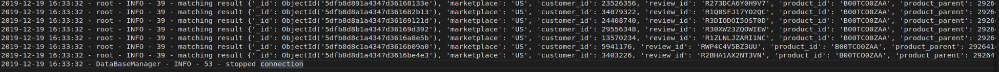

# Take-home Project
Using MongoDB to store the amazon-review dataset from S3. Each file (category) is stored as one collection in the database instance “amazon_review”. A class named “DataBaseManger” was designed in `DataBaseManger.py` and `in main.py`, an instance of DataBaseManger was created and queried the database based on a given condition. 

Directly run $ python3 main.py will generated two log files in the log folder. The returned matching documents were recorded in `info_log`.



## Dependencies
```
python3.4+ 
pymongo : $pip3 install pymongo	
mongodb : $pip3 install mongodb
pyymal : $pip3 install pyymal
```
## Features
- Connecting to the database and the collection
- Adding and dropping indexes on given collection
- Searching and returning documents on a query criteria
- Inserting and deleting records

## Files
`DataBaseManger.py`

`main.py`

`logs`
   - `error_log`
   - `info_log`

`utils`

  - `logging.yaml`

`logs` folder contains log message from logging.error() and logging.info(). Both are using TimedRotatingFileHandler. They are set to rotate every 3 days and having 3 files in total, e.g., error_log, error_log_2019_12_19, error_log_2019_12_20. The most updated log is in the file without any suffix.

`utils` folder contains the yaml file for the logging configuration. In the ` main.py`, the setup_logging function loads the configuration.


## Why using MongoDB? 

First, looking at the structure of the amazon-review dataset, it has 50 files, which share the same set of entries. Each file is one product category and it does not have relation with any other files. Since there is no need for joining files, we can rule out relational databases.

Second, this dataset contains historical data from 1995 until 2015. The first line of each category file contains names of all possible fields. For each record, not all fields have values. I assume  the end-user of this dataset inclines to do sentiment analysis on it and don’t have the intention to modify the data frequently, in other words, the application is read-heavy and the database will serves as a long-term storage tool. 

Therefore, we should look at a database that has a high read/write rate, and has aggregation operations for basic manipulations.

Both ElasticSearch and MongoDB fit the requirements. I would take MongoDB as persistent storage, and ElasticSearch on top of it for doing complex text search queries if needed.

